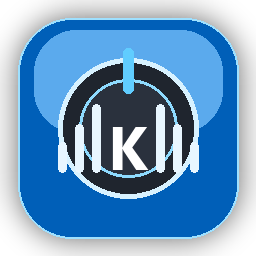

# KnobMixer

[](https://github.com/vtaeely/KnobMixer/actions/workflows/build-windows.yml)
[](LICENSE)
[](https://www.python.org/)
[](#требования)

**KnobMixer** — Windows-приложение для управления громкостью конкретного приложения через клавиши громкости, медиакнопки или физический USB-регулятор.

<p align="center">
  
</p>

## Что делает программа

Обычно клавиши `Volume Up`, `Volume Down`, `Mute` и физические регуляторы громкости меняют общую громкость Windows. KnobMixer перехватывает эти события и применяет их к выбранному приложению: Spotify, Discord, браузеру, игре или любому другому процессу с активной аудиосессией.

Пример:

```text
Выбрано: Spotify.exe

Volume Up   -> увеличить громкость только Spotify
Volume Down -> уменьшить громкость только Spotify
Mute        -> включить/выключить mute только у Spotify
```

Изменение общей громкости Windows подавляется по возможности. Полная блокировка master volume не всегда гарантируется из-за ограничений Windows и особенностей некоторых HID-устройств.

## Возможности

- Показывает активные Windows audio sessions.
- Управляет Spotify, Discord, браузерами, играми и другими процессами со звуком.
- Запоминает выбранный процесс по имени.
- Управляет всеми аудиосессиями выбранного процесса.
- Автоматически восстанавливает управление, если процесс закрылся и открылся снова.
- Поддерживает `VK_VOLUME_UP`, `VK_VOLUME_DOWN`, `VK_VOLUME_MUTE`.
- Поддерживает Raw Input / HID Consumer Control для многих мультимедийных клавиатур, макропадов и USB-регуляторов громкости.
- Перехват регулятора всегда включён; чекбокс в UI намеренно заблокирован.
- Работает в системном трее Windows.
- Хранит настройки в JSON.
- Собирается в standalone `.exe` через PyInstaller.

## Требования

- Windows 10 или Windows 11.
- Python 3.11+ для запуска из исходников.
- Для некоторых устройств или программ, запущенных от администратора, может потребоваться запуск KnobMixer от имени администратора.

## Запуск из исходников

```bat
git clone https://github.com/vtaeely/KnobMixer.git
cd KnobMixer
py -3.12 -m venv venv
venv\Scripts\activate
python -m pip install --upgrade pip
pip install -r requirements.txt
python main.py
```

Если Python 3.12 не установлен:

```bat
py -3.11 -m venv venv
```

## Сборка exe

```bat
build.bat
```

Готовый файл появится здесь:

```text
dist\KnobMixer.exe
```

## Как это работает

1. KnobMixer получает список активных аудиосессий Windows.
2. Пользователь выбирает приложение в интерфейсе или через трей.
3. Программа запоминает имя процесса.
4. События громкости ловятся через low-level keyboard hook и/или Raw Input.
5. Громкость выбранного процесса меняется через `pycaw`.
6. Если у процесса несколько аудиосессий, управляются все подходящие сессии.
7. Если процесс закрыт, приложение показывает статус, что целевое приложение не найдено.
8. Если процесс снова появился с тем же именем, управление восстанавливается автоматически.

## Используемые технологии

- **PyQt6** — интерфейс.
- **pycaw** — работа с Windows audio sessions.
- **comtypes** — COM-интерфейсы Windows.
- **psutil** — информация о процессах.
- **pywin32** — Raw Input и Windows messages.
- **ctypes** — low-level keyboard hook.
- **PyInstaller** — сборка `.exe`.

## Ограничения

Windows не всегда позволяет полностью заблокировать изменение общей громкости. Особенно это касается устройств, которые отправляют громкость как HID Consumer Control.

Лучше всего подавление работает со стандартными клавишами:

```text
VK_VOLUME_UP
VK_VOLUME_DOWN
VK_VOLUME_MUTE
```

Для USB-регуляторов Raw Input может увидеть событие, но Windows всё равно может успеть изменить master volume.

## Если что-то не работает

Смотри [docs/TROUBLESHOOTING.md](docs/TROUBLESHOOTING.md).

## GitHub Actions

Workflow собирает `KnobMixer.exe` на Windows и загружает его как artifact. После успешной сборки файл можно скачать из последнего workflow run.

## Лицензия

MIT License. Смотри [LICENSE](LICENSE).
